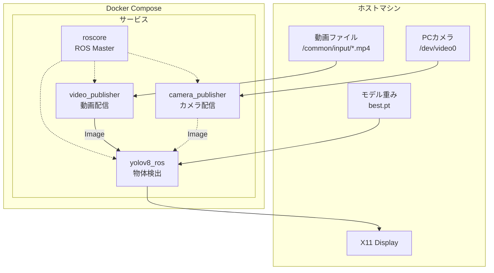
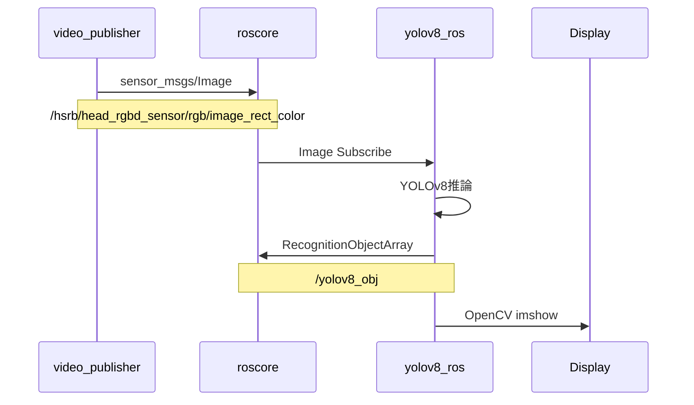
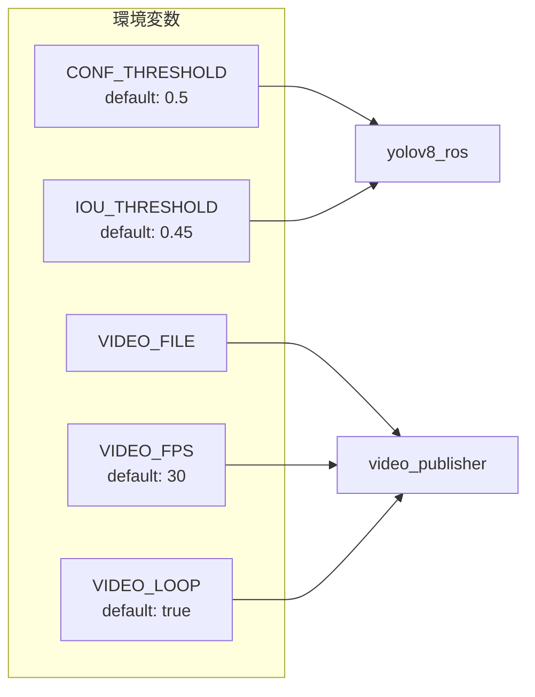
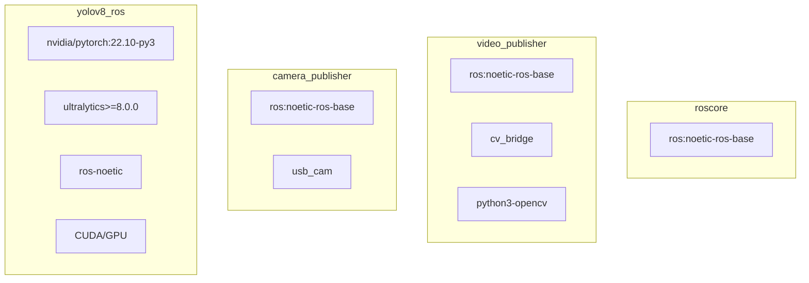
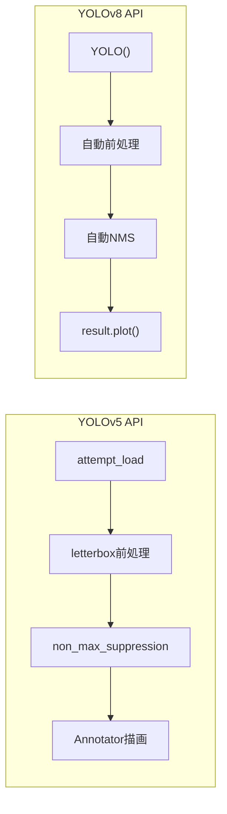

# ROS YOLO - Docker物体検出環境

ROS1 Noetic + YOLOv8 物体検出システム。Docker Composeで簡単に起動可能。

## システムアーキテクチャ



## データフロー



## ディレクトリ構造

```
ros_yolo/
├── docker/
│   ├── docker-compose.yml      # サービス定義
│   ├── Dockerfile              # YOLOv8コンテナ (CUDA + PyTorch + Ultralytics)
│   ├── Dockerfile.camera       # カメラコンテナ
│   ├── Dockerfile.video        # 動画コンテナ
│   ├── ros_entrypoint.sh
│   └── requirements.txt
│
└── catkin_ws/src/
    ├── yolov8_ros/             # YOLOv8検出パッケージ
    │   ├── scripts/
    │   │   ├── ros_yolov8.py   # メイン検出ノード
    │   │   └── viewer.py
    │   ├── msg/
    │   │   ├── RecognitionObject.msg
    │   │   └── RecognitionObjectArray.msg
    │   └── weights/            # モデル重み (volume mount)
    │
    ├── video_publisher/        # 動画配信パッケージ
    │   ├── scripts/
    │   │   └── video_publisher.py
    │   └── launch/
    │       └── video.launch
    │
    ├── camera_publisher/       # カメラ配信パッケージ
    │   └── launch/
    │       └── camera.launch
    │
    └── yolov5_ros/             # YOLOv5 (レガシー)
```

## クイックスタート

### 1. X11許可設定
```bash
xhost +local:docker
```

### 2. Dockerイメージのビルド
```bash
cd ros_yolo/docker
docker compose build
```

### 3. 起動（動画入力）
```bash
docker compose up roscore video yolo
```

### 4. 起動（カメラ入力）
```bash
# docker-compose.ymlのyoloサービスのdepends_onをvideoからcameraに変更
docker compose up roscore camera yolo
```

### 5. 停止
```bash
docker compose down
```

## 環境変数



| 変数 | デフォルト | 説明 |
|------|-----------|------|
| `CONF_THRESHOLD` | 0.5 | 検出信頼度閾値 |
| `IOU_THRESHOLD` | 0.45 | NMS IoU閾値 |
| `VIDEO_FILE` | /videos/IMG_0763-1.mp4 | 入力動画パス |
| `VIDEO_FPS` | 30 | 動画配信FPS |
| `VIDEO_LOOP` | true | ループ再生 |

### 閾値を変更して起動
```bash
CONF_THRESHOLD=0.3 IOU_THRESHOLD=0.5 docker compose up roscore video yolo
```

## ROSトピック

```mermaid
graph LR
    subgraph Publishers
        V[video_publisher]
        C[camera_publisher]
    end

    subgraph Topics
        IMG[/hsrb/head_rgbd_sensor/<br>rgb/image_rect_color]
        OBJ[/yolov8_obj]
    end

    subgraph Subscribers
        Y[yolov8_ros]
    end

    V -->|sensor_msgs/Image| IMG
    C -.->|sensor_msgs/Image| IMG
    IMG --> Y
    Y -->|RecognitionObjectArray| OBJ
```

### 入力トピック
- `/hsrb/head_rgbd_sensor/rgb/image_rect_color` (sensor_msgs/Image)

### 出力トピック
- `/yolov8_obj` (yolov8_ros/RecognitionObjectArray)

## カスタムメッセージ

### RecognitionObject.msg
```
int16 x_min
int16 y_min
int16 x_max
int16 y_max
float32 confidence
string class_name
```

### RecognitionObjectArray.msg
```
std_msgs/Header header
yolov8_ros/RecognitionObject[] array
```

## コマンドライン引数

| 引数 | デフォルト | 説明 |
|------|-----------|------|
| `--weights` | yolov8n.pt | モデルファイルパス |
| `--topic` | /camera/rgb/image_rect_color | 入力画像トピック |
| `--conf-thres` | 0.5 (env: CONF_THRESHOLD) | 信頼度閾値 |
| `--iou-thres` | 0.45 (env: IOU_THRESHOLD) | NMS IoU閾値 |
| `--imgsz` | 640 | 入力画像サイズ |
| `--max-det` | 1000 | 最大検出数 |
| `--device` | (自動) | 使用デバイス (cuda/cpu) |
| `--view_img` | false | 検出結果を表示 |
| `--line-thickness` | 1 | バウンディングボックス線幅 |

## モデル設定

現在のモデル:
- **パス**: `competition_20251210_003413/weights/best.pt`
- **タイプ**: YOLOv8s (22MB)
- **クラス数**: 17

### 検出クラス
```
banana, clamp_big, clamp_small, cup_purple, cup_red, dice,
lego_block, mango, mustard, orange, padlock, pear, plum,
soft_scrub, strawberry, tomato_soup, windex
```

## コンテナ構成



## 修正履歴

| 日付 | 修正内容 | 変更ファイル |
|------|---------|-------------|
| 2024-12-10 | YOLOv5からYOLOv8へ移行 | ros_yolov8.py, Dockerfile |
| 2024-12-10 | video_publisher追加 | video_publisher/, Dockerfile.video |
| 2024-12-10 | 環境変数による閾値設定 | docker-compose.yml, ros_yolov8.py |
| 2024-12-10 | バウンディングボックス線幅調整 (3→1px) | ros_yolov8.py |
| 2024-12-10 | デバッグログ追加 | ros_yolov8.py |

## YOLOv5 vs YOLOv8 API比較



| 機能 | YOLOv5 | YOLOv8 |
|------|--------|--------|
| モデルロード | `attempt_load()` | `YOLO()` |
| 前処理 | 手動 (letterbox) | 自動 |
| NMS | `non_max_suppression()` | 自動 |
| 描画 | `Annotator` | `result.plot()` |
| パッケージ | `pip install yolov5` | `pip install ultralytics` |

## トラブルシューティング

### X11表示が出ない
```bash
xhost +local:docker
echo $DISPLAY  # :0 または :1 を確認
```

### GPUが認識されない
```bash
nvidia-smi  # GPUが見えるか確認
docker info | grep -i gpu  # Docker GPU対応確認
```

### 1クラスしか検出されない
```bash
# 信頼度閾値を下げてテスト
CONF_THRESHOLD=0.25 docker compose up roscore video yolo
```

### カメラが認識されない
```bash
ls -la /dev/video*
v4l2-ctl --list-devices
```

### catkin_makeエラー
```bash
cd /catkin_ws
source /opt/ros/noetic/setup.bash
catkin_make
source devel/setup.bash
```

## HSR実機接続モード

```bash
export ROS_MASTER_URI=http://hsrb.local:11311
export ROS_IP=192.168.1.xxx  # 自分のIPアドレス

docker compose run yolo python3 /catkin_ws/src/yolov8_ros/scripts/ros_yolov8.py \
    --weights /catkin_ws/src/yolov8_ros/weights/best.pt \
    --topic /hsrb/head_rgbd_sensor/rgb/image_rect_color \
    --view_img
```
